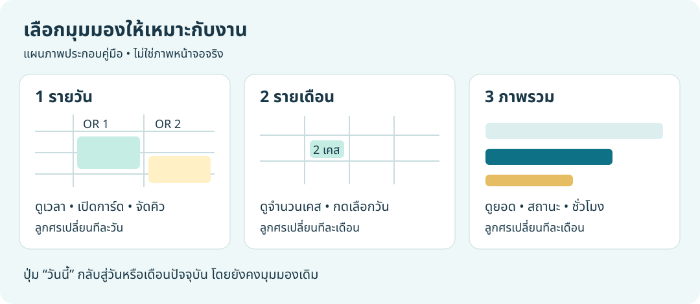
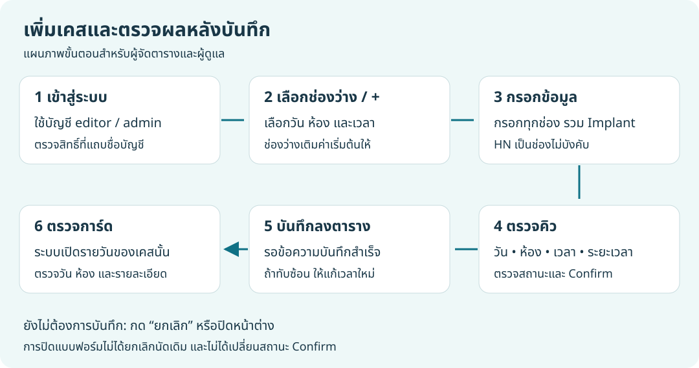
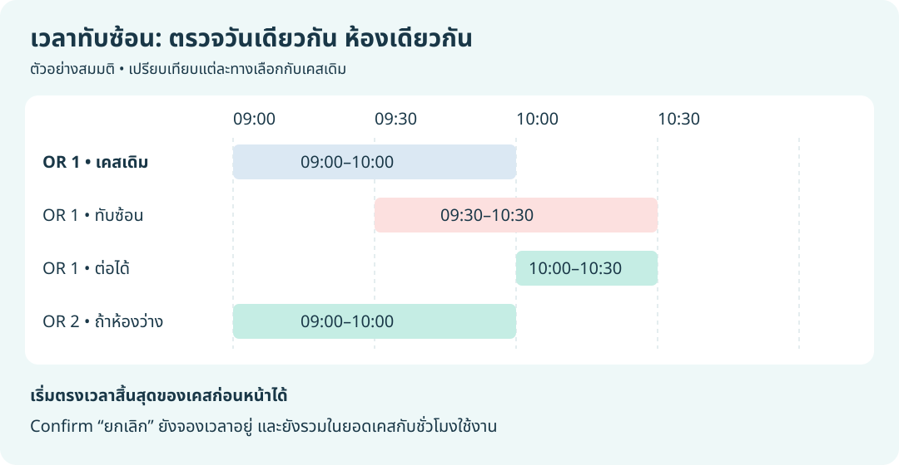

# คู่มือใช้งาน OR Planning Board

สำหรับผู้ดูตารางและเจ้าหน้าที่ผู้จัดคิวผ่าตัด ตรวจสอบกับระบบใน repository วันที่ 26 กันยายน 2569 (2026-09-26)

เปิดเว็บไซต์ตาม URL ที่ผู้ดูแลแจ้ง หากผู้ดูแลเปิดระบบบนเครื่องนี้ด้วยค่ามาตรฐาน ให้เข้า `http://127.0.0.1:8090/` ส่วนการติดตั้งและจัดการบัญชีสำหรับผู้ดูแลอยู่ใน [คู่มือดูแลระบบ](OPERATIONS.md)

ภาพในคู่มือนี้เป็นแผนภาพอธิบายการใช้งาน ไม่ใช่ภาพหน้าจอจริง และไม่มีข้อมูลผู้ป่วยจริง

## เริ่มใช้งานอย่างรวดเร็ว

1. เปิดเว็บไซต์ แล้วเลือก **รายวัน** เพื่อดูคิว OR 1 และ OR 2
2. ใช้ลูกศรซ้าย–ขวาเปลี่ยนวัน หรือกด **วันนี้** เพื่อกลับมาวันปัจจุบัน
3. กดการ์ดเคสเพื่อดูรายละเอียด
4. หากต้องจัดตาราง ให้กดไอคอน **เข้าสู่ระบบ** ด้านบน แล้วใช้บัญชีที่มีสิทธิ์ผู้จัดตารางหรือผู้ดูแล
5. กด **+** หรือช่องเวลาว่าง กรอกข้อมูล แล้วกด **บันทึกลงตาราง**

## 1. บัญชีและสิทธิ์ใช้งาน

| ผู้ใช้งาน | ดูตารางและรายละเอียด | เพิ่ม / แก้ไข / ลบเคส |
| --- | --- | --- |
| ยังไม่เข้าสู่ระบบ | ได้ | ไม่ได้ |
| ผู้ชม (`viewer` / ดูอย่างเดียว) | ได้ | ไม่ได้ |
| ผู้จัดตาราง (`editor`) | ได้ | ได้ |
| ผู้ดูแล (`admin`) | ได้ | ได้ |

บัญชีที่สมัครด้วยตนเองจะเป็น **ผู้ชม** เสมอ หากต้องการจัดตาราง ให้ติดต่อผู้ดูแลเพื่อเปลี่ยนสิทธิ์ ปัจจุบันผู้ดูแลและผู้จัดตารางมีสิทธิ์จัดการเคสเท่ากัน และไม่มีหน้าจัดการผู้ใช้งานในหน้าเว็บตาราง

### เข้าสู่ระบบ

1. กดไอคอน **เข้าสู่ระบบ** บริเวณด้านบนขวา (ก่อนเข้าสู่ระบบ ปุ่มตำแหน่งนี้ยังไม่ใช่ปุ่มเพิ่มเคส)
2. กรอกอีเมลและรหัสผ่านบัญชีเจ้าหน้าที่ แล้วกด **เข้าสู่ระบบ**
3. เมื่อสำเร็จ ด้านบนจะแสดงชื่อบัญชีและสิทธิ์ ผู้จัดตารางและผู้ดูแลจะใช้ปุ่ม **+** เพิ่มเคสได้

### สมัครบัญชีใหม่

1. เปิดหน้าต่างเข้าสู่ระบบ แล้วกด **สร้างบัญชีใหม่**
2. กรอกชื่อที่แสดง อีเมล รหัสผ่าน 8–72 ตัวอักษร และยืนยันรหัสผ่านให้ตรงกัน
3. กด **สร้างบัญชีผู้ชม** แล้วรอข้อความ **สร้างบัญชีแล้ว**
4. กด **ไปที่หน้าเข้าสู่ระบบ** เพื่อกลับหน้าตาราง จากนั้นกดไอคอนเข้าสู่ระบบและใช้บัญชีที่เพิ่งสมัคร ระบบไม่ได้เข้าสู่ระบบให้อัตโนมัติ

### ออกจากระบบหรือเปลี่ยนบัญชี

กดแถบชื่อบัญชีด้านบน แล้วเลือก **ออกจากระบบ** หรือกรอกบัญชีใหม่และกด **เข้าสู่ระบบบัญชีอื่น** ควรออกจากระบบเมื่อใช้งานเครื่องส่วนกลางเสร็จ หากลืมรหัสผ่านให้ติดต่อผู้ดูแล ปัจจุบันหน้าเว็บยังไม่มีปุ่มรีเซ็ตรหัสผ่านด้วยตนเอง

## 2. เลือกมุมมองและวันที่

| มุมมอง | ใช้ทำอะไร | ลูกศรซ้าย–ขวา |
| --- | --- | --- |
| **รายวัน** | ดูเวลา ห้อง และรายละเอียดเคสในวันที่เลือก | เปลี่ยนทีละวัน |
| **รายเดือน** | ดูจำนวนเคสแต่ละวัน กดวันที่เพื่อเปิดตารางรายวัน | เปลี่ยนทีละเดือน |
| **ภาพรวม** | ดูยอดเคส สัดส่วนสถานะ วันที่มีเคสมากที่สุด และชั่วโมงรวมแต่ละห้อง | เปลี่ยนทีละเดือน |

ปุ่ม **วันนี้** เปลี่ยนวันที่อ้างอิงกลับเป็นวันปัจจุบัน โดยคงมุมมองที่เปิดอยู่ เช่น ในภาพรวมจะกลับมาสรุปเดือนปัจจุบัน

### อ่านตารางรายวัน

- ตารางแบ่งเป็น **OR 1** และ **OR 2** แสดงช่วง 08:00–21:00 ทีละ 30 นาที เลือกเวลาเริ่มได้ตั้งแต่ 08:00 ถึง 20:30
- การ์ดแสดงเวลาเริ่ม ระยะเวลา สถานะ Confirm ชื่อผู้ป่วยและ HN (ถ้ามี) แพทย์ หัตถการ การระงับความรู้สึก และ Implant
- สีการ์ดอ้างอิงช่อง **สถานะ** โดยดูคำอธิบายสีเหนือบริเวณตารางประกอบ
- กดการ์ดเพื่อเปิดรายละเอียด ผู้ชมและผู้ที่ยังไม่เข้าสู่ระบบจะอ่านได้อย่างเดียว
- บนโทรศัพท์ เลื่อนภายในตารางในแนวนอนเพื่อดูอีกห้อง คอลัมน์เวลาจะคงอยู่ และเลื่อนแนวตั้งเพื่อดูช่วงเวลาถัดไป

ตารางแสดงถึง 21:00 จึงควรวางระยะเวลาให้สิ้นสุดภายในช่วงที่แสดง อย่าอาศัยความสูงของการ์ดเพียงอย่างเดียวเมื่อตรวจเคสที่ยาวเลยท้ายตาราง

### อ่านรายเดือนและภาพรวม

ช่องวันที่ในรายเดือนแสดงเฉพาะจำนวนเคส ไม่มีชื่อผู้ป่วยหรือเวลา กดวันที่นั้นเพื่อดูรายละเอียดในรายวัน

ภาพรวมคำนวณจากเคสใน **เดือนที่เลือก**: ยอดทั้งหมด จำนวนตามสถานะ สัดส่วนสถานะ วันที่มีเคสมากที่สุดสูงสุด 4 วัน และผลรวมระยะเวลาเคสของ OR 1 / OR 2 แถบชั่วโมงใช้เปรียบเทียบระหว่างสองห้อง ไม่ใช่เปอร์เซ็นต์การใช้ความจุห้องทั้งหมด

## 3. เพิ่มเคสผ่าตัด

ใช้ได้เมื่อเข้าสู่ระบบด้วยบัญชีผู้จัดตารางหรือผู้ดูแล

1. เลือกวันผ่าตัดในตาราง
2. กดช่องเวลาว่างในห้องที่ต้องการ ระบบจะเติมวัน ห้อง และเวลาเริ่มให้ หรือกด **+** เพื่อเปิดแบบฟอร์มแล้วเลือกค่าเอง
3. ตรวจและกรอกข้อมูลตามตารางด้านล่าง
4. ตรวจวัน ห้อง เวลา ระยะเวลา และสถานะทั้งสองช่อง แล้วกด **บันทึกลงตาราง**
5. รอข้อความ **เพิ่มเคสลงตารางเรียบร้อยแล้ว** และตรวจการ์ดที่ปรากฏ ระบบจะเปิดรายวันของวันที่บันทึก

| ช่องข้อมูล | วิธีกรอก |
| --- | --- |
| วันผ่าตัด | เลือกวันที่ต้องการนัด |
| ห้องผ่าตัด | เลือก OR 1 หรือ OR 2 |
| เวลาเริ่ม | เลือกเวลาเป็นช่วงละ 30 นาที |
| ระยะเวลาโดยประมาณ | เลือก 30, 60, 90, 120, 180 หรือ 240 นาที |
| รายชื่อผู้ป่วย (ชื่อ–นามสกุล) | กรอกชื่อและนามสกุลให้ถูกต้อง |
| HN | ไม่บังคับกรอก ระบบเปลี่ยนตัวอักษรภาษาอังกฤษเป็นตัวพิมพ์ใหญ่เมื่อบันทึก |
| แพทย์ผู้ทำหัตถการ | กรอกชื่อแพทย์ |
| หัตถการ | ระบุชื่อหัตถการหรือรายละเอียดสำคัญ |
| ประเภทการระงับความรู้สึก | ดมยาสลบ / ฉีดยาชา / ระงับความรู้สึกเฉพาะส่วน |
| สถานะ | เลือกสถานะการจัดคิว OR ตามหัวข้อถัดไป |
| Implant | เป็นช่องบังคับกรอก ระบุข้อมูลตามแนวทางของหน่วยงาน; หากไม่มี ให้ใช้ข้อความที่หน่วยงานกำหนด เช่น “ไม่มี” |
| สถานะ Confirm | เลือก Confirm / ไม่รับสาย / ยกเลิก |

ทุกช่องยกเว้น HN เป็นช่องบังคับ หากยังไม่ต้องการบันทึก ให้กด **ยกเลิก** หรือปุ่มปิดหน้าต่าง ข้อมูลที่แก้ในฟอร์มจะไม่ถูกบันทึก

### “สถานะ” กับ “สถานะ Confirm” ต่างกันอย่างไร

| ช่อง | ตัวเลือก | ใช้แสดงผล |
| --- | --- | --- |
| สถานะ | OR รับเคสแล้ว / รอจัดห้อง / รอประสานงาน | สีการ์ด และยอดแบ่งตามสถานะในภาพรวม |
| สถานะ Confirm | ✅ Confirm / 📞 ไม่รับสาย / ❌ ยกเลิก | ข้อความกำกับบรรทัดเวลาในการ์ด |

สองช่องนี้แยกจากกัน การเปลี่ยน Confirm ไม่ได้เปลี่ยนสถานะการจัดคิวโดยอัตโนมัติ

**การเลือก Confirm เป็น “ยกเลิก” ไม่ได้ลบเคสหรือคืนช่องเวลา** เคสยังแสดงในตาราง ยังนับในยอดและชั่วโมงรวม และยังถูกตรวจเวลาทับซ้อนเช่นเดียวกับเคสอื่น หากต้องนำเคสออกจากตาราง ให้ดำเนินการตามแนวทางของหน่วยงานและขั้นตอนลบเคสด้านล่าง

## 4. แก้ไข ย้ายเวลา และลบเคส

### แก้ไขหรือย้ายเคส

1. กดการ์ดเคสเดิมเพื่อเปิด **แก้ไขเคสผ่าตัด**
2. เปลี่ยนข้อมูลที่ต้องการ หากย้ายคิวให้เปลี่ยนวัน ห้อง เวลาเริ่ม หรือระยะเวลาในแบบฟอร์ม
3. กด **บันทึกลงตาราง** แล้วรอข้อความ **อัปเดตเคสเรียบร้อยแล้ว**
4. ตรวจการ์ดในวันและห้องปลายทาง การย้ายเคสทำผ่านแบบฟอร์ม ไม่มีการลากการ์ดเพื่อย้ายเวลา

### ลบเคส

1. เปิดเคสและตรวจให้แน่ใจว่าเป็นรายการที่ต้องการนำออก
2. กด **ลบเคส** จะมีหน้าต่าง **ลบเคสนี้ใช่ไหม**
3. เลือก **เก็บเคสไว้** เพื่อยกเลิกการลบ หรือ **ลบเคส** เพื่อยืนยัน

การลบนำข้อมูลออกจากตาราง และไม่มีปุ่มย้อนกลับในหน้าเว็บ ส่วนปุ่ม **ยกเลิก** ที่ท้ายแบบฟอร์มเพียงปิดการแก้ไข ไม่ได้เปลี่ยนสถานะ Confirm และไม่ได้ลบเคส

## 5. เมื่อเวลาทับซ้อน

ระบบไม่อนุญาตให้เคสใน **วันเดียวกันและห้องเดียวกัน** มีเวลาทับกัน โดยตรวจทั้งก่อนส่งแบบฟอร์มและที่เซิร์ฟเวอร์ รวมถึงเคสที่รอจัดห้อง รอประสานงาน หรือมี Confirm เป็นยกเลิก

ตัวอย่าง: OR 1 มีเคส 09:00–10:00 แล้ว เคสใหม่ใน OR 1 เวลา 09:30–10:30 จะทับกัน แต่เริ่ม 10:00 ได้ ส่วน OR 2 ใช้ช่วงเดียวกันได้ถ้าไม่มีเคสของห้องนั้นทับอยู่

เมื่อบันทึกไม่ได้ ให้ตรวจวัน ห้อง เวลาเริ่ม และระยะเวลา แล้วเลือกช่วงว่างใหม่ หากมีเจ้าหน้าที่อื่นจัดตารางพร้อมกัน เซิร์ฟเวอร์อาจปฏิเสธเวลาที่เพิ่งถูกจอง ให้ตรวจตารางล่าสุดก่อนบันทึกอีกครั้ง

## 6. พิมพ์ตารางหรือบันทึก PDF

1. เลือกมุมมองและวันหรือเดือนที่ต้องการพิมพ์
2. กดไอคอนเครื่องพิมพ์ **พิมพ์ตาราง** ด้านบน
3. ตรวจตัวอย่างก่อนพิมพ์ เลือกแนวนอนหากเบราว์เซอร์ไม่ได้เลือกให้ และปรับขนาดให้เหมาะกับกระดาษ
4. เลือกเครื่องพิมพ์ หรือเลือกบันทึกเป็น PDF หากเบราว์เซอร์รองรับ

ระบบพิมพ์เฉพาะมุมมองที่เปิดอยู่ และซ่อนปุ่มควบคุม **ข้อความหัตถการในการ์ดรายวันถูกซ่อนในรูปแบบพิมพ์** อีกทั้งการ์ดถูกย่อ จึงควรตรวจว่ารายละเอียดที่ต้องการอ่านได้ครบก่อนแจกจ่าย เอกสารพิมพ์ไม่ใช่สำเนารายละเอียดเคสทั้งหมด

## 7. ข้อมูลอัปเดตและปัญหาที่พบบ่อย

ค่าปัจจุบันของระบบโหลดข้อมูลใหม่ทุกประมาณ **30 วินาทีขณะที่แท็บเปิดแสดงอยู่** จึงอาจไม่เห็นการเปลี่ยนแปลงจากเครื่องอื่นทันที หากต้องการตรวจล่าสุด สามารถรีโหลดหน้าเว็บหลังบันทึกงานที่ค้างในแบบฟอร์มแล้ว

| อาการ | สิ่งที่ควรตรวจ |
| --- | --- |
| ไม่พบปุ่มเพิ่มเคส มีไอคอนเข้าสู่ระบบแทน | เข้าสู่ระบบด้วยบัญชีเจ้าหน้าที่ก่อน |
| เข้าสู่ระบบแล้ว แต่ปุ่มเพิ่มใช้ไม่ได้ | ดูสิทธิ์บนแถบชื่อบัญชี บัญชีผู้ชมต้องให้ผู้ดูแลเปลี่ยนสิทธิ์ |
| สมัครแล้วเพิ่มเคสไม่ได้ | บัญชีสมัครใหม่เป็นผู้ชมเสมอ |
| เข้าสู่ระบบไม่สำเร็จ | ตรวจอีเมล รหัสผ่าน และการเชื่อมต่อ หากยังไม่ได้ให้ผู้ดูแลตรวจสถานะบัญชี |
| บันทึกไม่ได้เพราะข้อมูลไม่ครบ | กรอกทุกช่องบังคับ รวม Implant และตรวจข้อความใต้แบบฟอร์ม |
| แจ้งเวลาทับซ้อน หรือข้อความ `overlap` | เปลี่ยนเวลา ระยะเวลา หรือห้องตามช่องว่างจริง และตรวจเคสที่ Confirm เป็นยกเลิกด้วย |
| ข้อมูลไม่อัปเดตหรือโหลดไม่ได้ | ตรวจการเชื่อมต่อและวัน/เดือนที่เลือก รีโหลดหลังจัดการงานที่ยังไม่บันทึก หากยังผิดปกติให้แจ้งผู้ดูแล |
| ออกจากระบบแล้วตารางว่างชั่วคราว | รอรอบโหลดข้อมูล หรือรีโหลดหน้าเว็บ; การออกจากระบบไม่ได้ลบเคส |
| รูปพิมพ์มีรายละเอียดน้อยกว่าหน้าจอ | ตรวจตัวอย่างก่อนพิมพ์ หัตถการถูกซ่อนและการ์ดถูกย่อในรูปแบบพิมพ์ |

หากบันทึกแล้วการเชื่อมต่อขาดหายจนไม่แน่ใจว่าสำเร็จหรือไม่ ให้ตรวจตารางล่าสุดก่อนสร้างรายการซ้ำ เมื่อติดต่อผู้ดูแล ให้แจ้งขั้นตอน มุมมอง วันเวลาเกิดปัญหา และข้อความผิดพลาด โดยปิดบังข้อมูลผู้ป่วยในภาพประกอบ

## 8. การใช้ข้อมูลอย่างเหมาะสม

ระบบรุ่นปัจจุบันเปิดให้อ่านตารางและรายละเอียดเคสได้โดยไม่ต้องเข้าสู่ระบบ รวมถึงชื่อผู้ป่วย HN หัตถการ และเวลานัด การออกจากระบบไม่ได้ทำให้ข้อมูลเหล่านี้เป็นส่วนตัว ก่อนบันทึกข้อมูลผู้ป่วยจริง หน่วยงานต้องตัดสินใจเรื่องการเปิดเผยข้อมูลนี้ตาม [ข้อกำหนดด้านข้อมูลและความปลอดภัยของโครงการ](SECURITY.md)

ใช้บัญชีของตนเอง และเก็บภาพหน้าจอ เอกสารพิมพ์ หรือ PDF เฉพาะในช่องทางที่หน่วยงานอนุญาต

## เอกสารที่เกี่ยวข้อง

- [สารบัญเอกสาร](INDEX.md)
- [การติดตั้งและเริ่มระบบ](../README.md)
- [การดูแลระบบและเปลี่ยนสิทธิ์บัญชี](OPERATIONS.md)
- [ข้อมูลและความปลอดภัย](SECURITY.md)
